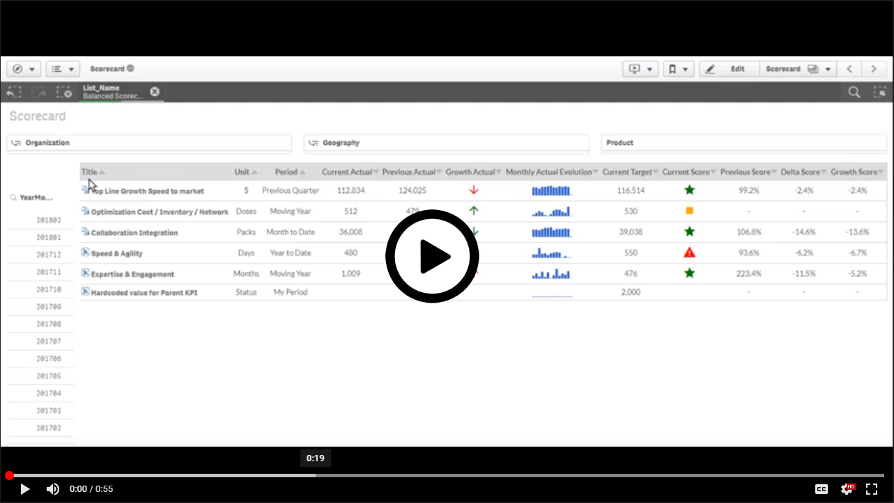
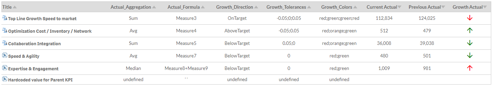
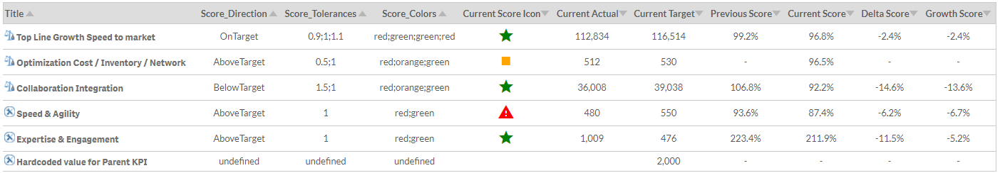
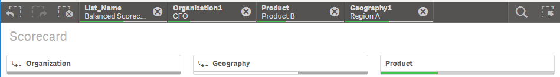
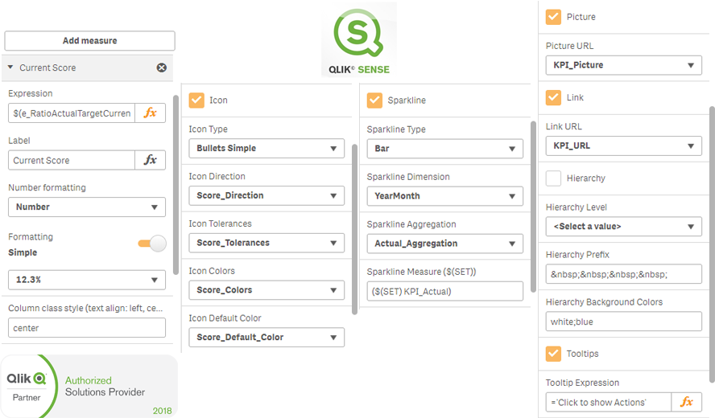

### PIT Business
This content is part of a library of solutions build by PIT Business based on the experience of its experts. 
Please visit [PIT Business Website](http://www.pit-business.com) to **discover our Services and Solutions** for Scorecard, Stratgy Map, Master Data Management, BI Catalog, BI ChatBot, Project Portfolio Management, Dependency Graphs, ... 
*PIT Business, the best Qlik Influence Partner in Luxembourg & Belgium.* 

# Scorecard
**Scorecards** provide an organization with an ideal way for executing and controlling its strategy by tracking the right **Key Performance Indicators (KPI's)** in comparison to corresponding **targets** and as such enabling visibility in every direction. Furthermore scorecarding helps in **aligning and empowering** the different teams and departmental layers which are present in an organization, by effectively **communicating goals and their actual performance** in a consistent way. [Source](http://www.element61.be/en/competence/strategy-management-scorecarding). 
 
 
 
Ability to list multidisciplinary KPI’s which by their nature have different:<
- **Time periods**: Default current period, Previous period, Comparison period
- **Aggregations**: Sum for revenue, Average or Last for FTE’s, Ratio for Satisfaction
- **Cross KPI's**: Complex calculation with weights, 0.6*Measure8 + 0.4*Measure9
 

Each KPI has its own **score** rules:
- **Target**: Dedicated facts, Derived from Actuals
- **Direction**: Above the target, Below the target, On the target
- **Tolerances**: My score is < 80%, <100%, >= 110%
- **Color-coding's**: [80%;100%] => [red;orange;green]

Navigate & cascade simultaneously through **multiple perspectives** due to multi-dimensional live calculations:

All these features available in a customizable **Qlik Sense extension**, developed & supported by your official Qlik Sense Influence Partner [PIT Business](http://www.pit-business.com)

## Which challenges does it address?

**Business Users**
- Solution to track the right KPI's in comparison to targets
- Address a reliable Scorecard framework to handle all the complexity and flexibility of KPI's definitions
- Get a Scorecard solution aligned with company's standards & guidelines and current infrastructure

**BICC/IT**
 - If BICC/IT needs to provide a datamodel to manage KPI's definitions and metadata
 - For BICC/IT to provide a Scorecard solution on top of Qlik Sense platform, to keep the governance in Qlik platform
 - Enjoy all the power and performance of the Qlik associative model

----------

## Versions

Version: 1.4
  -  Possibility to change the period from default period to custom period for all KPI's
  -  Multiple hierarchies of responsibilities (Multi-dimensional)
  -  Dedicated picture by KPI

Version: 1.3
  -  Period information in Tooltips
  -  Inline charts for measures
  -  Extension working 100% offline
  -  Pre-defined ratio calculations: RatioCurrentPreviousActual, RatioCurrentActualTarget, RatioPreviousActualTarget, ...

Version: 1.2
  -  Score calculation with Tolerances
  -  Growth calculation with Tolerances
  -  Score & Growth Icons with Color-coding's
  -  Filter inside-set for measures

Version: 1.1
  -  Dedicated Actual & Target calculation by KPI
  -  Dedicated default period by KPI
  -  Style with classes by column
  -  Link URL for dimensions
  -  Hierarchy indent for dimensions
  -  Tooltips for dimensions

## Architecture
 
Techonologies: Qlik Sense, HTML, CSS, JavaScript, JQuery, MySQL, PostgreSQL, SQL Server, Excel, MongoDB, Oracle Database, SQL Server, and many more databases compatible.

## Quick-install

----------

### Copyright
Licensed under the GNU AGPLv3 
*Strongest copyleft license are conditioned on making available complete source code of licensed works and modifications, which include larger works using a licensed work, under the same license. Copyright and license notices must be preserved. Contributors provide an express grant of patent rights. When a modified version is used to provide a service over a network, the complete source code of the modified version must be made available.* 
Information about the license at https://choosealicense.com/licenses/agpl-3.0 
 
For commercial use, contact us via [PIT Business Website](http://www.pit-business.com) 
Copyright 2018 PIT Business SARL 
